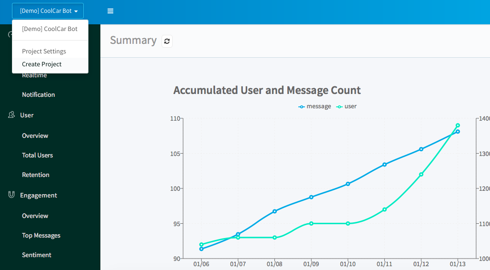

# Getting Started

Welcome to use Botimize, the conversation analytics platform for bot builders.

In here, we are giving an example of building a botimize integrated messenger bot, written in nodeJS.

We also provide the same example for other platforms/languages, check out [our sample bot list](sample-bots).

## Four Steps
To get started, just follow four steps:
### 1. Create an analytics project on Botimize platform



### 2. Obtain the **API key**


### 3. Integrate our [SDK](https://www.npmjs.com/package/botimize) (or use **RESTful API**) to track your chatbot


#### Initialization
  ```javascript
  const botimize = require('botimize')('<YOUR-BOTIMIZE-API-KEY>', 'facebook');
  ```

#### Log Incoming
  ```javascript
  app.post('/webhook', function (req, res)) {
    botimize.logIncoming(req.body);
    ...
  }
  ```


#### Log Outgoing
  ```javascript
  let options = {
    uri: 'https://graph.facebook.com/v2.6/me/messages',
    qs: { access_token: accessToken },
    method: 'POST',
    json: true,
    body: messageBody,
  };
  request(options, function (error, response, body) {
    botimize.logOutgoing(options, {parse: 'request'});
    ...
  });
  ```

### 4. View analytics on our [dashboard](https://dashboard.getbotimize.com/)
