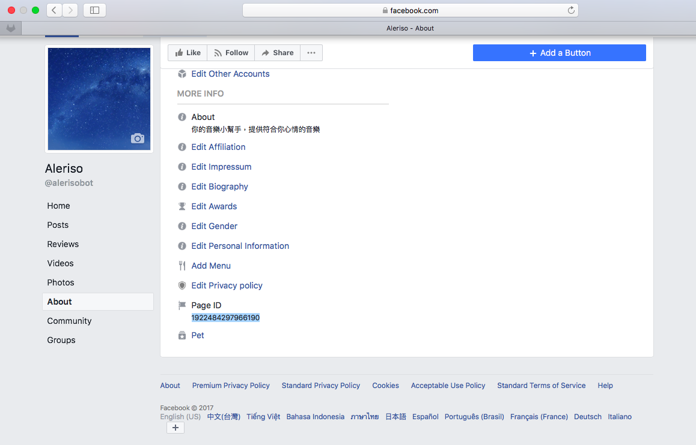
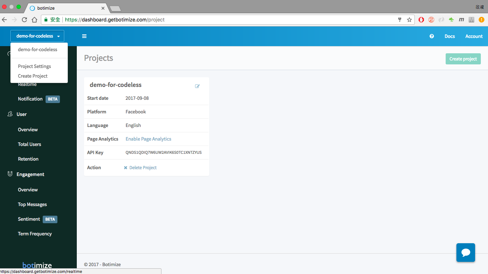

# codeless

## Introduction
 
Codeless, no coding work to integrate analytics on your Facebook chatbot, or Facebook page!  And there are some advantages to use codeless integration:

* No need to change your chatbot code, no side effects.
* Messenger platform handles message tracking, so the server load on your own server is reduced.

## How to use it

Here is a three-steps guide to create a codeless project, which analyze the conversation between your fans page and your users without coding.

- step 0. Create a botimize project

- step 1. Find out your [page ID](https://www.facebook.com/help/1503421039731588) on your facebook page

- step 2. Enable page analytics with your facebook fans page ID 

Now the conversation between you and your users will be automatically collected, analyzed, and showed up on the dashboard.
